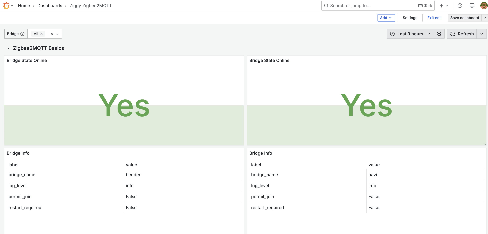
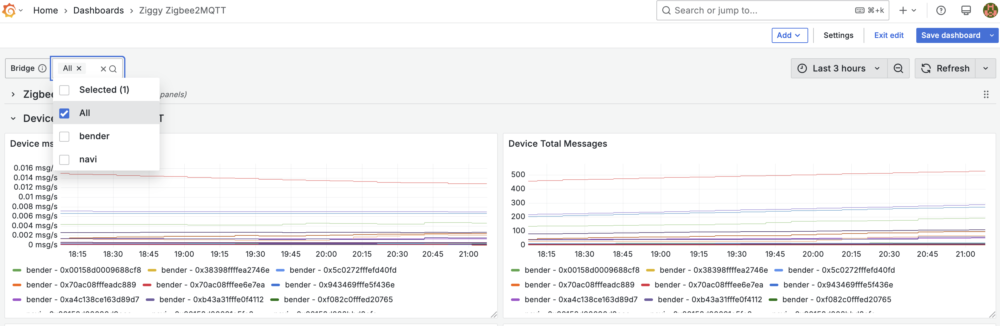

# Ziggy API

[](https://GitHub.com/jzucker2/ziggy/releases/)
[](https://github.com/jzucker2/ziggy/actions/workflows/docker.yml)
[](https://github.com/jzucker2/ziggy/actions/workflows/python_unittests.yml)
[](https://github.com/jzucker2/ziggy/actions/workflows/python_lint.yml)


A FastAPI app for Zigbee device management with MQTT integration and comprehensive Prometheus metrics.

Want a [grafana](https://grafana.com/oss/grafana/) dashboard like this?





## Features

- **FastAPI REST API** with health checks and metrics endpoints
- **MQTT Integration** using fastapi-mqtt for Zigbee2MQTT communication
- **Prometheus Metrics** for both MQTT and Zigbee2MQTT health monitoring
- **Comprehensive Logging** with configurable levels and formats
- **Docker Support** for easy deployment
- **Extensive Testing** with pytest

## Quick Start

### Prerequisites

- Python 3.8+
- MQTT Broker (e.g., Mosquitto)
- Zigbee2MQTT (optional, for Zigbee device management)

### Installation

1. **Clone the repository:**

   ```bash
   git clone <repository-url>
   cd ziggy
   ```

2. **Create and activate virtual environment:**

   ```bash
   python -m venv venv
   source venv/bin/activate  # On Windows: venv\Scripts\activate
   ```

3. **Install dependencies:**

   ```bash
   pip install -r requirements.txt
   ```

4. **Set up environment variables:**

   ```bash
   # Copy example environment file
   cp .env.example .env

   # Edit .env with your configuration
   nano .env
   ```

5. **Run the application:**

   ```bash
   python -m uvicorn app.main:app --host 0.0.0.0 --port 8000 --reload
   ```

## Configuration

### Environment Variables

#### MQTT Configuration

```bash
# Enable MQTT (required)
MQTT_ENABLED=true

# MQTT Broker Settings
MQTT_BROKER_HOST=localhost
MQTT_BROKER_PORT=1883
MQTT_USERNAME=your_username
MQTT_PASSWORD=your_password
MQTT_CLIENT_ID=ziggy-api

# MQTT Topics
ZIGBEE2MQTT_BASE_TOPIC=zigbee2mqtt
ZIGBEE2MQTT_BRIDGE_NAME=my-bridge
```

#### Logging Configuration

```bash
# Logging Level
LOG_LEVEL=INFO

# Logging Format
LOG_FORMAT=detailed  # simple, detailed, json

# Logging Handlers
LOG_HANDLERS=console,file  # console, file, or both
```

#### Gunicorn Configuration

The application uses Gunicorn with Uvicorn workers for production deployment. All Gunicorn settings are configurable via environment variables:

```bash
# Worker Configuration
GUNICORN_WORKERS=4                    # Number of worker processes (default: CPU cores * 2 + 1)
GUNICORN_WORKER_CLASS=uvicorn.workers.UvicornWorker  # Worker class
GUNICORN_WORKER_CONNECTIONS=1000      # Max concurrent connections per worker
GUNICORN_MAX_REQUESTS=1000           # Max requests before worker restart
GUNICORN_MAX_REQUESTS_JITTER=50      # Jitter for max requests

# Server Configuration
GUNICORN_BIND=0.0.0.0:8000          # Server socket binding
GUNICORN_BACKLOG=2048                # Connection backlog

# Timeout Settings
GUNICORN_TIMEOUT=30                  # Worker timeout in seconds
GUNICORN_KEEPALIVE=2                 # Keep-alive connection timeout
GUNICORN_GRACEFUL_TIMEOUT=30         # Graceful shutdown timeout

# Logging
GUNICORN_LOG_LEVEL=info              # Log level (debug, info, warning, error, critical)
GUNICORN_ACCESS_LOG=-                # Access log file (- for stdout, empty for disabled)
GUNICORN_ERROR_LOG=-                 # Error log file (- for stderr)
GUNICORN_ACCESS_LOG_FORMAT='%(h)s %(l)s %(u)s %(t)s "%(r)s" %(s)s %(b)s "%(f)s" "%(a)s" %(D)s'

# Process Management
GUNICORN_PROC_NAME=ziggy             # Process name
GUNICORN_DAEMON=false                # Run as daemon
GUNICORN_PIDFILE=                    # PID file location
GUNICORN_USER=                       # User to run as
GUNICORN_GROUP=                      # Group to run as

# Security
GUNICORN_LIMIT_REQUEST_LINE=4094     # Max request line size
GUNICORN_LIMIT_REQUEST_FIELDS=100    # Max request header fields
GUNICORN_LIMIT_REQUEST_FIELD_SIZE=8190  # Max request header field size

# Performance
GUNICORN_PRELOAD_APP=true            # Preload application for better performance
```

**Example Docker Compose with Gunicorn configuration:**

```yaml
version: '3.8'
services:
  ziggy:
    build: .
    ports:
      - "8000:8000"
    environment:
      # MQTT Configuration
      - MQTT_ENABLED=true
      - MQTT_BROKER_HOST=mqtt-broker
      - MQTT_BROKER_PORT=1883
      - MQTT_USERNAME=your_username
      - MQTT_PASSWORD=your_password

      # Gunicorn Configuration
      - GUNICORN_WORKERS=4
      - GUNICORN_TIMEOUT=30
      - GUNICORN_LOG_LEVEL=info
      - GUNICORN_ACCESS_LOG=-
      - GUNICORN_MAX_REQUESTS=1000
      - GUNICORN_MAX_REQUESTS_JITTER=50

      # Logging Configuration
      - LOG_LEVEL=INFO
      - LOG_FORMAT=detailed
      - LOG_HANDLERS=console
    depends_on:
      - mqtt-broker
```

### Zigbee2MQTT Setup

To enable Zigbee2MQTT health monitoring, ensure your Zigbee2MQTT configuration includes:

```yaml
# Zigbee2MQTT configuration.yaml
mqtt:
  server: mqtt://localhost:1883
  user: your_username
  pass: your_password

# Enable health monitoring
health_check:
  enabled: true
  topic: zigbee2mqtt/bridge/health  # This will be constructed from ZIGBEE2MQTT_BASE_TOPIC + /bridge/health
```

## API Endpoints

### Core Endpoints

- `GET /` - Root endpoint with API information
- `GET /health` - Health check with system status
- `GET /metrics` - Prometheus metrics endpoint

### MQTT Endpoints

- `GET /mqtt/status` - MQTT connection status and configuration
- `GET /mqtt/metrics` - MQTT-specific metrics information

### Zigbee2MQTT Endpoints

- `GET /zigbee2mqtt/metrics` - Zigbee2MQTT health metrics information

## Prometheus Metrics

Ziggy exposes comprehensive Prometheus metrics for monitoring Zigbee2MQTT bridge health, state, and information. All metrics are prefixed with `ziggy_` and include detailed labels for filtering and aggregation.

### Application Information

- **`ziggy_app_info_info`**: Application information including version, platform, Python version, and environment details
  - Labels: `app_name`, `version`, `name`, `description`, `python_version`, `python_implementation`, `platform_system`, `platform_release`, `platform_version`, `platform_machine`, `platform_processor`, `environment_environment`, `environment_log_level`

### Bridge Health Metrics

- **`ziggy_zigbee2mqtt_bridge_health_timestamp`**: Last bridge health update timestamp
- **`ziggy_zigbee2mqtt_os_load_average_1m`**: 1-minute load average
- **`ziggy_zigbee2mqtt_os_load_average_5m`**: 5-minute load average
- **`ziggy_zigbee2mqtt_os_load_average_15m`**: 15-minute load average
- **`ziggy_zigbee2mqtt_os_memory_used_mb`**: Memory usage in MB
- **`ziggy_zigbee2mqtt_os_memory_percent`**: Memory usage percentage
- **`ziggy_zigbee2mqtt_process_uptime_seconds`**: Process uptime in seconds
- **`ziggy_zigbee2mqtt_process_memory_used_mb`**: Process memory usage in MB
- **`ziggy_zigbee2mqtt_process_memory_percent`**: Process memory usage percentage
- **`ziggy_zigbee2mqtt_mqtt_connected`**: MQTT connection status (1=connected, 0=disconnected)
- **`ziggy_zigbee2mqtt_mqtt_queued_messages`**: Number of queued MQTT messages
- **`ziggy_zigbee2mqtt_mqtt_published_messages_total`**: Total published MQTT messages
- **`ziggy_zigbee2mqtt_mqtt_received_messages_total`**: Total received MQTT messages

### Zigbee2MQTT Metrics

All Zigbee2MQTT metrics are prefixed with `ziggy_zigbee2mqtt_`:

#### Bridge Health Metrics

- `ziggy_zigbee2mqtt_bridge_health_timestamp` - Last health check timestamp

#### Bridge State Metrics

- `ziggy_zigbee2mqtt_bridge_state` - Bridge state (1=online, 0=offline)
- `ziggy_zigbee2mqtt_bridge_state_timestamp` - Last bridge state update timestamp

#### Bridge Info Metrics

- `ziggy_zigbee2mqtt_bridge_info_version` - Bridge version information (version, commit)
- `ziggy_zigbee2mqtt_bridge_info_coordinator` - Bridge coordinator information (ieee_address, type)
- `ziggy_zigbee2mqtt_bridge_info_network` - Bridge network information (channel, pan_id, extended_pan_id)
- `ziggy_zigbee2mqtt_bridge_info_bridge` - Bridge settings information (log_level, permit_join, permit_join_end, restart_required)
- `ziggy_zigbee2mqtt_bridge_info_os` - Bridge OS information (version, node_version, cpus, memory_mb)
- `ziggy_zigbee2mqtt_bridge_info_mqtt` - Bridge MQTT information (server, version)
- `ziggy_zigbee2mqtt_bridge_info_timestamp` - Last bridge info update timestamp

**Note**: Bridge info metrics are limited to essential fields by default. To add more fields, use the helper functions:

- `add_bridge_info_field(category, field_name)` - Add a new field to metrics
- `remove_bridge_info_field(category, field_name)` - Remove a field from metrics

Available categories: `version`, `coordinator`, `network`, `bridge`, `os`, `mqtt`

#### OS Metrics

- `ziggy_zigbee2mqtt_os_load_average_1m` - 1-minute CPU load average
- `ziggy_zigbee2mqtt_os_load_average_5m` - 5-minute CPU load average
- `ziggy_zigbee2mqtt_os_load_average_15m` - 15-minute CPU load average
- `ziggy_zigbee2mqtt_os_memory_used_mb` - Used memory in MB
- `ziggy_zigbee2mqtt_os_memory_percent` - Used memory percentage

#### Process Metrics

- `ziggy_zigbee2mqtt_process_uptime_seconds` - Zigbee2MQTT uptime
- `ziggy_zigbee2mqtt_process_memory_used_mb` - Process memory usage in MB
- `ziggy_zigbee2mqtt_process_memory_percent` - Process memory percentage

#### MQTT Metrics

- `ziggy_mqtt_connection_status` - MQTT connection status (1=connected, 0=disconnected)
- `ziggy_mqtt_connection_attempts_total` - Total number of MQTT connection attempts
- `ziggy_mqtt_connection_failures_total` - Total number of MQTT connection failures
- `ziggy_mqtt_messages_received_total` - Total number of MQTT messages received (Zigbee2MQTT bridge topics only)
- `ziggy_mqtt_messages_published_total` - Total number of MQTT messages published
- `ziggy_mqtt_message_size_bytes` - Size of MQTT messages in bytes
- `ziggy_mqtt_processing_duration_seconds` - Time taken to process MQTT messages
- `ziggy_mqtt_processing_errors_total` - Total number of MQTT message processing errors
- `ziggy_mqtt_subscriptions_active` - Number of active MQTT subscriptions
- `ziggy_mqtt_subscription_attempts_total` - Total number of MQTT subscription attempts
- `ziggy_mqtt_subscription_failures_total` - Total number of MQTT subscription failures
- `ziggy_mqtt_client_info` - MQTT client information

**Note**: MQTT message metrics are limited to Zigbee2MQTT bridge topics (health, state, info) only. General MQTT messages are processed but not tracked in Prometheus metrics.

#### Device Metrics

- `ziggy_zigbee2mqtt_device_leave_count` - Current device leave events
- `ziggy_zigbee2mqtt_device_network_address_changes` - Current network address changes
- `ziggy_zigbee2mqtt_device_messages` - Current device messages
- `ziggy_zigbee2mqtt_device_messages_per_sec` - Current messages per second per device
- `ziggy_zigbee2mqtt_device_appearances_total` - Total times device appeared in health messages

## Docker Deployment

### Using Docker Compose

1. **Create docker-compose.yml:**

   ```yaml
   version: '3.8'
   services:
     ziggy:
       build: .
       ports:
         - "8000:8000"
       environment:
         - MQTT_ENABLED=true
         - MQTT_BROKER_HOST=mqtt-broker
         - MQTT_BROKER_PORT=1883
         - MQTT_USERNAME=your_username
         - MQTT_PASSWORD=your_password
       depends_on:
         - mqtt-broker

     mqtt-broker:
       image: eclipse-mosquitto:latest
       ports:
         - "1883:1883"
       volumes:
         - ./mosquitto.conf:/mosquitto/config/mosquitto.conf
   ```

2. **Run with Docker Compose:**

   ```bash
   docker-compose up -d
   ```

### Using Docker

1. **Build the image:**

   ```bash
   docker build -t ziggy-api .
   ```

2. **Run the container:**

   ```bash
   docker run -d \
     --name ziggy-api \
     -p 8000:8000 \
     -e MQTT_ENABLED=true \
     -e MQTT_BROKER_HOST=your-mqtt-host \
     -e MQTT_BROKER_PORT=1883 \
     -e MQTT_USERNAME=your_username \
     -e MQTT_PASSWORD=your_password \
     ziggy-api
   ```

## Development

### Running Tests

```bash
# Run all tests
python -m pytest tests/ -v

# Run specific test file
python -m pytest tests/test_mqtt_metrics.py -v

# Run with coverage
python -m pytest tests/ --cov=app --cov-report=html
```

### Code Quality

```bash
# Linting
flake8 app/ tests/ --max-line-length=88 --extend-ignore=E203,W503

# Formatting
black app/ tests/

# Type checking
mypy app/
```

### Project Structure

```
ziggy/
├── app/
│   ├── __init__.py
│   ├── main.py              # FastAPI application
│   ├── mqtt_client.py       # MQTT client implementation
│   ├── mqtt_metrics.py      # MQTT Prometheus metrics
│   ├── zigbee2mqtt_metrics.py  # Zigbee2MQTT health metrics
│   └── logging_config.py    # Logging configuration
├── tests/
│   ├── __init__.py
│   ├── test_main.py         # API endpoint tests
│   ├── test_mqtt.py         # MQTT client tests
│   ├── test_mqtt_metrics.py # MQTT metrics tests
│   ├── test_zigbee2mqtt_metrics.py  # Zigbee2MQTT metrics tests
│   └── test_logging.py      # Logging tests
├── requirements.txt          # Python dependencies
├── Dockerfile               # Docker configuration
├── docker-compose.yml       # Docker Compose setup
├── prometheus.yml           # Prometheus configuration
└── README.md               # This file
```

## Monitoring and Alerting

### Prometheus Configuration

Add to your `prometheus.yml`:

```yaml
scrape_configs:
  - job_name: 'ziggy'
    static_configs:
      - targets: ['localhost:8000']
    metrics_path: '/metrics'
    scrape_interval: 15s
```
